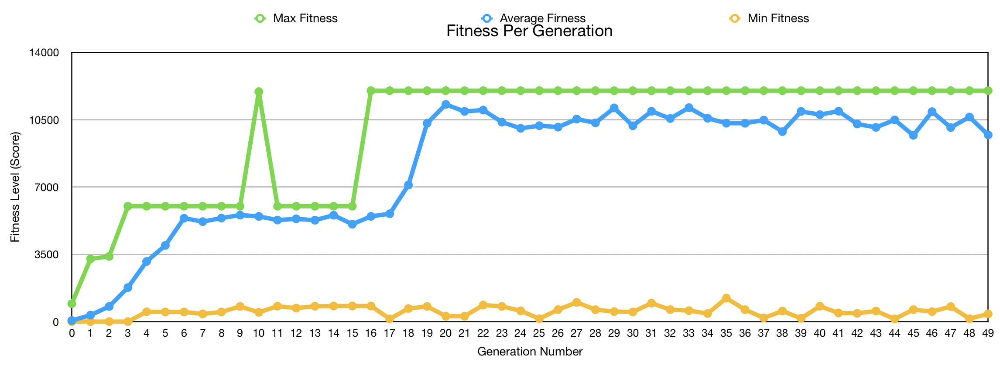

# Tetris AI

  The program allows the user to play the classic game of Tetris or if selected the AI can play a game for you.
  A best first search algorithm is used to choose the next state of the Tetris game.

  This program also has an option to run a genetic algorithm (GA).

## Developers

* **Jonathan Ishii**     ------ [Godsinred](https://github.com/Godsinred)

## Prerequisites
A web browser.

Pythin 3.6 (if you want to convert the GA console output to a csv for analysis)
Download:
  * https://www.python.org/downloads/

## Getting Started

You will need any browser with JavaScript capabilities. To run double click index.html and it will open in your default browser or drag and drop the file into a browser.

To start the AI click the "Play For Me" button or to play the game your self click the "Start Game" button.
If you want to run the GA click "Start GA"

## Technical Implementation
When the program is first started it creates the game board and sets up all the GUI.

From here we can either choose Start Game and play the game ourselves or Start AI.

### Breakdown for Best First Search
When Start AI is first called we initialize our best first search object. Once initialized we call our startAI function which will run until the game is over. For each iteration of this function we grab the currently active piece along with the hold piece and the set of next 3 pieces from the game. This means you can call this function mid game to finish it for you. From here we create the states that the active and hold piece can go to next. We do this by looking at every rotation and position that the piece can be moved to. Next we add the states to the open list if they are not duplicates and sort the list by putting the states with the highest heuristic value in front. After the current state is no longer needed the state is put on the closed list.

The program stops when the next state we get from the open list has no items in the list of next pieces, we assume that this is our best state that we can go to and move the Tetris pieces on the board accordingly. We repeat this until the game is over.

### Breakdown for Genetic Algorithm
The GA starts off by initializing the genome population by randomly creating genomes for a predefined population size. Once created the genomes are tested and given a certain fitness level based off of their performance. Selecting the, X, elitist genomes we choose them randomly to breed and make children. We mutate their children's attributes if the random value is below the mutation rate. If they are chosen to be mutated, we add a random number multiplied by the mutation step times 2 and then subtract the mutation step. We do it this way so we can either modify the attribute in a positive or negative direction. This is done for the whole size of the population to replace their parents for the next generation. This process of selection, crossover, and mutation is done for as many iteration as we would like. In our case 50.

This chart breaks down the max, average, and min genome per generation. We can see over the course of 50 genomes that the GA converges to a local maxima of about 12010.

### Challenges
1. Trying to represent the state along with the state space. The game of Tetris looks simple from the outside, but trying to represent the state and how all the information of the game is going to be passed to is children is complicated.

    * This was solved by having 2 classes. One for the best first serach algorithm to hold most of the game board / data and another one for the state of the game, given all the pieces available, the layout of the board, the score, etc. This allowed the best first search algorithm to have all the data readily available for the state so when it was created we can just pass all the data from the best first search class to the state class.

2. Since the game of Tetris is to not lose there is no goal state except for not losing. This makes the general best first search impossible to do since it will continue running forever or until your computer blows up.

    * This forces the change of the best first search goal. Knowing that we don't want to lose the goal becomes trying to stay alive and scoring the most points. This can be achieved by setting up the pieces having a good board layout along with some luck! We look at the number of gaps, standard deviation of the height, max height, and whether we can score or not.

3. Optimization. The state space of Tetris is ginormous, so going through all the states and creating all of them is time and space expensive.

    * A work around this is look at a small set of pieces at a time and choose the best state from there. Also dynamically creating all the states instead of creating everything before hand shaves off a lot of time as well.

4. Displaying each move of the AI so that is visible to the human eye.

    * Have not found a solution to this. Still new to JS so trying to figure out everything that is going on in the browser is complicated. Something with the canvas object (used for drawing the board) and the browser processing it slowly isn't optimized. (Tried to sleep, defer, async, and setTimeout).

5. Writing to a file in js.

  * Since js is meant to be server side. There are issues trying to write the output of the GA to a csv for further analysis. The work around was writing everything to the console and then converting that into a csv file using python.

## Break down of the code

## index.html

This file holds the canvas where the Tetris board is created and updated on.
It is also responsible for loading all the JavaScript(js) into the browser.

## tetris.js

### Class Game
This holds the html canvas object for where we kept track of the pieces and other essential variable of the game.

##### Class Game - function drawBoarder()
This draws the outside of the Tetris board

##### Class Game - function drawSquare()
This function can be called to draw squares on the cnavas. It will be used many times to draw an undraw all the Tetris pieces.

##### Class Game - function fill()
Calls the draw square class for only the areas where the Tetris pieces reside in. Can choose the color for removing and adding pieces.

##### Class Game - function draw()
Draws in the Tetris piece be calling fill with the color of drawing.

##### Class Game - function unDraw()
Removes the Tetris piece from the board by calling fill with the color EMPTY.

##### Class Game - function collision()
Determines if there is collision between the piece and the board. It takes in the direction it is going and compares it to the matrix of the board. It also determines if a piece is near a wall and if so how much should it move to be able to rotate. Usually 1 but the long I in a certain roation needs 2 because of where the piece is in it rotation.

##### Class Game - function moveDown()
If the piece can move down 1 square it will move it down.

##### Class Game - function moveLeft()
If the piece can move left 1 square it will move it left.

##### Class Game - function rotate()
Rotates the piece clockwise if there is no collision.

##### Class Game - function counterRotate()
Rotates the piece counter clockwise if there is no collision.

##### Class Game - function moveRight()
If the piece can move right 1 square it will move it right.

##### Class Game - function hardDrop()
Drops the piece as far down as it can go and then locks it to the board.

##### Class Game - function ghostDrop()
Drops the shadow or ghost piece of the actual piece to the bottom of the board, so the user has an easy visualization of where the hard drop piece will end up.

##### Class Game - function lock()
Locks the current tetromino to the board and clears any rows if applicable.
Sets up for the next piece as well.

##### Class Game - function getNextPiece()
Gets the next piece in the from the list and adds a piece to the list for its replacement.

##### Class Game - function getGhostColor()
Translates the current piece's color to the ghost's color.
We want this piece to naturally a little lighter so the user can determine the ghost piece from a piece that is locked to the board.

##### Class Game - function updateNextPiecesPNG()
Updates the pictures in the index.html page with the new current list of next pieces.

##### Class Game - function hold()
Holds the current piece and possibly switches it out with the current hold piece if applicable (The first held piece has nothing to switch with).

##### Class Game - function updatePNG()
Updates the param location with the color of the tetromino.

### document.addEventListener("keydown", CONTROL); - function CONTROL()
Listens for a keydown press and if there is it calls the CONTROL function.

### Class Piece

The exact tetromino that is the Piece. Has attributes of color, the rotations, which rotation number we are on, and which tetromino is currently active.

#### Class Piece - calcShiftAmount()
Determines how much the piece needs to shift to be able to rotate.

### function drop()
Starts the dropping of pieces sequence off. Will continuously keep dropping pieces until the game is over. The pieces drop faster as the game progresses.

### function displaySettings()
This will be where the user can change the keys of how the tetris pieces move.
--> Currently not implemented

### Class Random(seed)
Since there is no option to see the built in random class in js we used someone else's code of a random number generator.
https://gist.github.com/blixt/f17b47c62508be59987b
We want the code to be seeded so we test and debug our code we always get the same pieces.

#### Class Random(seed) - next()
Updates the seed value

### Class Random(seed) - nextFloat()
Call this function for a random float from 0-1 and not next.

### function StartGame()
This gets called when the button on the index.html get pressed so we can start the game for the user to play.

## best-first-serach.js
This is where the AI algorithm takes place. All the helper functions along with the heuristic is held within this file.

### Class BestFirstSearch
It has the current matrix state along with the path that the pieces will generate.

#### Class BestFirstSearch - function startAi()
This function is equivalent to calling a best first search function.
Call this function to start the best first search process. It will loop until the game is over. It starts off by getting the current, hold, and next set of pieces. It will look at the current and hold piece and evaluate the best state for each one. Once evaluated it will choose the higher value one and switch accordingly.

#### Class BestFirstSearch - function generateNextStates()
This function looks at every possible rotation and hard drop piece position from the top. It will evaluate it using the heuristic function defined within the State class.

#### Class BestFirstSearch - function moveFarLeft()
This moves the param piece all the way left until it collides with the wall or bound by the top.

#### Class BestFirstSearch - function hardDrop()
Drops the piece all the way to the bottom.

#### Class BestFirstSearch - function collision()
Detects collision with in the board. Either with the boarders or another piece within the game.

#### Class BestFirstSearch - function tempLock()
Locks the tetromino to the hardDrop location in the provided matrix. Once locked it will clear any lines and increment the score accordingly. The function will return the matrix back to the callee.

#### Class BestFirstSearch - function updatePath()
Based on the current state the function will update the class member variable this.path accordingly. This way when movePiece is called it will know exactly where to move the tetromino.

#### Class BestFirstSearch - function movePiece()
Moves the tetrominos based on the path.

#### Class BestFirstSearch - function getActualWidth()
Gets the actual physical width of the tetromino and not just the array length.

### function copy()
Take in the matrix to be copied and returns a duplicate.
Built in copy functions were returning a reference to the same array.

### sleep()
Takes in the amount of time to sleep.
Currently not working the way it is intended. Trying to figure out how to slow down the prorgam so we can see each piece movement. setTimeout() not working as intended either.

### Class State
The class holds the matrix (board state) that is being evaluated, how much score has increased to this state, the rotation of the piece, the x coordidate, if we lose going to this state, the max height of the matrix, the sums of the columns, and the heuristic evaluation.

#### Class State  - function heuristic()
Evaluates the state based on the number of gaps on the board, the max height, the standard deviation of all the column heights, wether we can score on this move and if we lose the game going to this state.

#### Class State  - function getHeight()
Gets the max height of all the rows and sums up how many 1 are in each column.

#### Class State  - function getNumGaps()
Gets how many gaps there are in the matrix and returns that value.

#### Class State  - function getStdHeight()
Gets the standard deviation of the height of the board and returns that value.

## start-ai.js
Has the main function which is called when the start AI button is clicked. This is in its own file because I was trying to defer the file from running until everything has been loaded so we can see each iteration. It only runs after everything has loaded atleast.

## tetrominos.js
Has all the tetrominos and their rotations in arrays.

## /assets
This folder has all the css and images for the web page.

## No breakdown of the code for the python or GA.

## Contribute
Contributions are always welcome!
